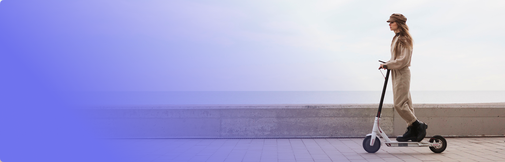

# KUGOO

Экзаменационный проект

      

        

          

            
          

          

            <svg class="header-addres-icon" width="15" height="15">
              <use href="img/sprite.svg#mark"></use>
            </svg>
            Восточно-Кругликовская улица, 86
            Вт - Сб 10:00 - 20:00
          

          

            <h2 class="header-title">Запишитесь на бесплатный тест-драйв электросамокатов</h2>
            
в Москве без ограничения по времени

          

          

            

              

                <svg class="header-chapter-icon" width="16" height="16">
                  <use href="img/sprite.svg#scooter"></use>
                </svg>
              

              
Поймете, какая модель вам подходит

            

            

              

                <svg class="header-chapter-icon" width="16" height="16">
                  <use href="img/sprite.svg#energy"></use>
                </svg>
              

              
Проверите лучшие самокаты в деле

            

          

          <button type="button" class="header-content-button signup-btn" data-target="#feedback-modal"
            aria-label="Записаться на тест-драйв электросамоката">
            Записаться
          </button>
        

      

    

